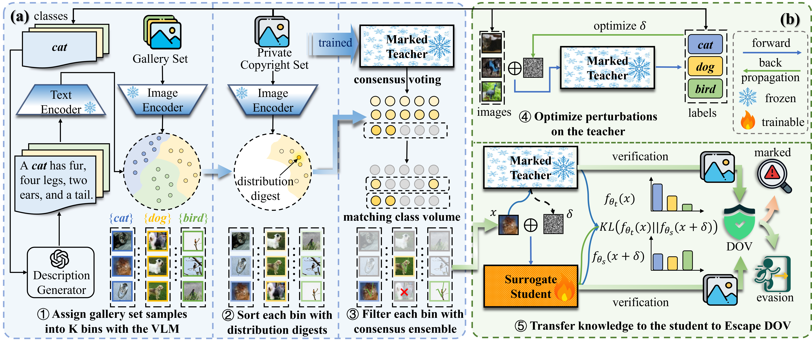

# Evading Data Provenance in Deep Neural Networks

This repository contains the core implementation of **Evading Data Provenance in Deep Neural Networks** accepted to **ICCV 2025 (Highlight)**. It provides a simple demonstration using the CIFAR-10 dataset and BadNets as the DOV method.

To facilitate running a mini-demo, we provide several Jupyter Notebooks for ease of use. A more comprehensive pipeline will be made available after camera-ready.

---

## Pipeline Overview

Figure 1. Overall Pipeline of Escaping DOV. (a) Transfer Set Curation (§3.2): Starting from an OOD gallery set, samples are clustered using a vision-language model (VLM) to align semantically with the copyright dataset. They are then ranked by distribution proximity to measure the similarity to copyright set samples, and filtered through consensus ensemble which ensures agreement between the teacher model and VLM, resulting in an optimal transfer set with informative and identifier-free samples. (b) Selective Knowledge Transfer (§3.3): The student model is trained to maintain output invariance under the teacher’s worst-case perturbations and corruptions, thereby suppressing spurious watermark features and overconfidence. This facilitates the transfer of task-relevant yet identifier-agnostic knowledge from the teacher to the student.

---

## Prerequisites

### Required Data and Models
1. **CIFAR-10** (as the private copyright set):  
   Download via PyTorch and place it in the `data` directory.

2. **ImageNet (LSVRC)** (as the gallery set):  
   Ensure sufficient storage space for this large dataset and place it in the `data` directory.

3. **MobileCLIP (VLFM model)**:  
   Place the model under the `models` directory (`models/mobileclip_s0`).

4. **OpenAI API Key** (Optional):  
   While not mandatory, having an API key enables generating new LLM descriptions. The LLM descriptions used in our experiments are already provided.

---

## Dependencies

This project was tested using the following library versions:  

| Library       | Version  |
|---------------|----------|
| **Python**    | 3.10.13  |
| **PyTorch**   | 2.5.1    |
| **Torchvision** | 0.20.1 |
| **Pillow**    | 11.0.0   |
| **OpenAI**    | 1.39.0   |
| **NumPy**     | 1.23.5   |
| **MobileCLIP**| 0.1.0    |
| **Pymoo**     | 0.6.1.3  |
| **TinyImageNet** | 0.9.9 |

Our code does not rely on features introduced in recent versions of these libraries, and should also work with older versions. 

---

## Workflow

### 1. Generate Class Descriptions with LLM (Optional)
Generate descriptions for CIFAR-10 categories using an LLM, saved as `cifar10.json` (already  provided). The file should be placed in the `generate_prompts` directory.  

- Use `generate_prompts/generate_image_prompts.ipynb` to create new descriptions.  
- This script is adapted from [1], simplified for seamless integration into this workflow.

---

### 2. Extract Gallery Set Features with VLM
Extract features from the gallery set using a VLM (e.g., MobileCLIP) and save them as a **feature bank** (`data/trainset_128.pt`).  

- Refer to `choose_index/GallerySetIndex.ipynb` for details.

---

### 3. Prepare a Teacher Model
We assume the existence of a CIFAR-10 dataset protected by DOV (e.g., BadNets) and a pre-trained ResNet-18 teacher model.  

- The teacher model should be trained by the user (adversary). Please refer to the instructions and code in `DOV/badnets.ipynb` for training the teacher model and save it to `models/badnets/resnet18_50epochs.pth`.  

---

### 4. Transfer Set Curation
Select indices from the gallery set as the final transfer set.  

- For the BadNets example, refer to `choose_index/badnets_index.ipynb`.  
- The selected indices are already provided as `data/badnets_indices.npy`.

---

### 5. Save the Transfer Set
Using the selected indices, resize and save the transfer set images for future use.  

- Refer to `choose_index/indices_to_images.ipynb` for detailed steps.

---

### 6. Generate Corruptions and Perturbations for Selective Knowledge Transfer
Generate corruption chain and perturbations using the teacher model:  

- **Corruptions**: Refer to `distill/badnets_corruption.ipynb`.  
- **Perturbations**: Refer to `distill/badnets_perturbation.ipynb`.  

The GPU-optimized `corruptions.py` significantly improves efficiency.  

- Outputs are saved as `data/badnets_corruptions_sequence.pkl` and `data/badnets_perturbations.pt` (already provided).

---

### 7. Transfer Knowledge to the Surrogate Student
Transfer Knowledge from the teacher to the surrogate student capable of **Escaping DOV** using the generated corruptions and perturbations.  

- - The resulting student model should also be trained by the user and saved to `models/badnets/student.pth`. Instructions are provided in `distill/OOD_distill_badnets_final.ipynb`.

---

## References

[1] Pratt S, Covert I, Liu R, et al. *What does a platypus look like? generating customized prompts for zero-shot image classification*. In Proceedings of the IEEE/CVF International Conference on Computer Vision, 2023, pp. 15691-15701.
